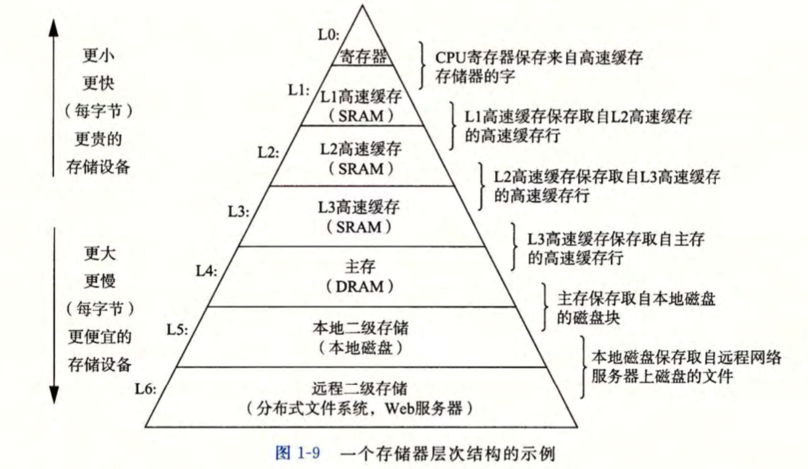

最近开始忙秋招，「码农翻身」公众号及同名书的作者老刘在知识星球里举办了读《CSAPP》的活动，之前一直没啃下来，希望能够借此机会逼自己一把，把这本厚厚的经典看完，并好好写笔记。


计算机系统 = 硬件 + 系统软件


作者如是说：

> “如果你全力投身学习本书中的概念，完全理解底 层计算机系统以及它对应用程序的影响，那么你会步上成为为数不多的“大牛"的道路。”


看完这本书你将会学到：

1. 实践技巧
2. 优化代码小窍门
3. 了解编译器如何实现
4. 如何识别和避免连接时那些令人讨厌的错误
5. 如何编写自己的 Unix shell
6. 认识并发的陷阱


## 1. 信息就是「位+上下文」

hello 程序生命周期开端：hel lo.c 源文件

* 由2进制的 ASCII 编码后的字符组成


文本文件：只有ASCII字符构成的文件。如：hello.c

二进制文件：非文本文件。


因此，在计算机的世界中，所有的信息都是由一串比特表示。

区分不同数据对象的唯一方法是我们读到这些数据对象时的上下文。


## 2. 程序被其他程序翻译成不同的格式

hello 程序生命周期：可执行文件，或者叫「目标程序」

编译器驱动程序：能够将「源文件」转化「目标文件」，如`gcc`


例子：

```
linux> gee -o hello hello.c
```

这一过程又叫翻译，可分为四个阶段：


执行这四个阶段的程序一起构成「编译系统」(compilation system)。

* 预处理阶段：修改源文件，得到另一个 C 程序。
  * 删除部分#开头的命令
  * 插入一些系统头文件，如`stdio.h`
* 编译阶段：翻译成汇编文本文件。
* 汇编阶段：将汇编文本文件翻译成机器语言指令，并打包成「可重定位目标程序」(relocatable object program)的格式。
* 链接阶段：合并一些调用的头文件，得到最终的可执行文件。


## 3. 了解编译系统如何工作

程序员必须知道编译系统如何工作的重要原因：

* 优化程序性能
* 理解连接时出现的错误
* 避免安全漏洞

## 4. 处理器读并解释储存在内存中的指令

系统的硬件：

* 总线（BUS）
  * 贯穿整个系统的一组电子管道
  * 通常总线被设计成传送定长的字节块，也就是字 (word)。字长是一个基本的系统参数，一般为 4 个字节( 32 位）或者 8 个字节（64位）。
* I/O设备
  * 系统与外部世界的联系通道。
  * 每个I/O设备都通过一个控制器或适配器与I/O总线相连。
* 主存(Main Memory)
  * 临时存储设备
  * 物理上：动态随机存取储存器(DRAM)。
  * 逻辑上：线性字节数组，每个字节都有其唯一的地址。
* 处理器（CPU）
  * 解释(或执行)存储在主存中指令的引擎


运行 hello 文件：

1. 在 shell 中输入`./hello` 之后，shell 程序将字符逐一读入寄存器，再把它放入内存。
2. 回车后，shell知道输入完成，开始执行一系列指令来加载可执行的 hello 文件。
3. 这些指令将 hello 目标文件从磁盘复制到内存中。
4. 处理器将目标文件中的机器语言指令复制到寄存器中，开始解析里面的指令并执行。
5. 数据被现实在屏幕上。


注：利用 DMA 技术可以不通过处理器而直接从磁盘到达主存。


## 5. 高速缓存至关重要

上一个运行 hello 程序的例子中，信息需要依次经过：磁盘，主存，寄存器。

这样会造成开销，减慢程序。


因此，需要使得这些复制操作尽可能快的完成。


## 6 储存设备形成层次结构



## 7 操作系统管理硬件

操作系统：应用程序和硬件之间插入的一层软件。

操作系统两大基本功能：

* 防止硬件被失控的应用程序滥用
* 向应用程序提供简单一致的机制来控制复杂而又通常大不相同的低级硬件设备。

操作系统提供三种基本的抽象：

1. 文件是对I/O设备的抽象
2. 虚拟内存是对主存和磁盘的抽象
3. 进程是处理器、主存和I/O设备的抽象

## 8 系统之间利用网络通信

网络可视为一个I/O设备。

## 9 重要主题

Amdahl定律：

并发和并行

计算机抽象