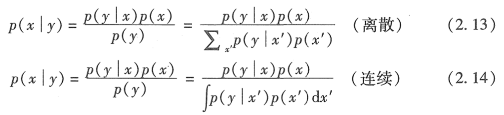
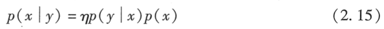
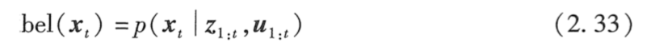
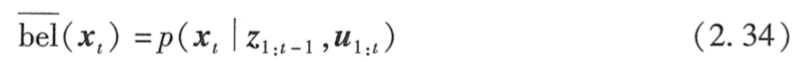
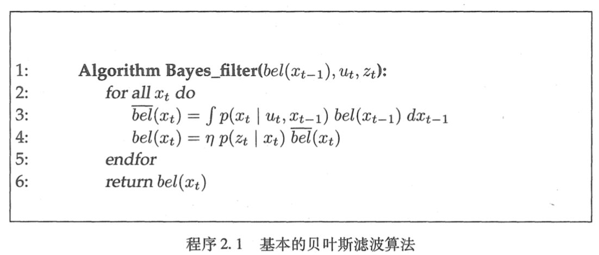

以此篇文章总结这学期郝老师教的《CS401 智能机器人》，主要内容为概率机器人，顺便复习期末考。

<!-- more -->

# 期末考试范围

1. 10 道多选 (20分)
2. Localization, mapping, tracking (20 分)
   - pose
   - Mapping
3. SLAM  (20分)
   - EKF
   - Particle Filter
4. Planning (20 分)
   - Path
   - Motion
5. Discussion （讨论题）(25分)
   - SLAM
     - EKF
     - PF
     - Graph
   - PLANNING
     - DWA
     - A*/5D
     - MARKOV Dicision

# 基础篇 Basic

## 第一章：绪论（Intro）

**机器人学**：机器人学是一门通过计算机控制设备来**感知**和**操纵**客观世界的科学。

**机器人中的不确定性**, 包括:

* 机器人环境 (robot environment) 
  * 环境是高度动态的而且在许多方面是无法预测的。
* 传感器 (sensor) 
  * 受限于它们所能感知的信息
  * 受到噪声的限制，它会以不可预知的方式干扰传感器测量，从而影响信息的提取，最后传感器会坏掉。
* 机器人的执行机构 (robot actuation) 
  * 不确定性来自如控制噪声、磨损及机械故障的影响。
* 内部模型 (internal model) 
  * 模型是真实世界的抽象，部分地模拟机器人机器环境的基本物理过程。
* 近似算法 (algorithmic approximation) 
  * 机器人是实时系统，这就限制了可执行的计算次数。
  * 许多流行的算法都是近似算法，它们通过牺牲精度而得到实时响应。

**概率机器人学 (probabilistic robotics) **：

* 起源

  * 20 世纪 90 年代中期
  * 根源要追溯到卡尔曼滤波器的发明 (Kalman, 1960) 。

* 目的

  * 致力于研究机器人感知和行为的不确定性。
  * 主要思想就是用概率理论的运算去**明确地表示**这种不确定性，不再只依赖可能出现的情况的单一的“最好推测"'而是用概率算法来表示在**整个推测空间的概率分布**信息。。
  * 以数学上合理的方式来表示模糊性和置信度。

* **为什么？**

  * 事实上，对千目前较为困难的机器人估计间题，如前面几页所讨论的定位问题，或者大环境构建精确地图的问题，概率算法是**目前已知唯一有效**的解决方法。

  

## 第二章：递归状态估计（Recursive State Estimation）

**状态估计**：

* 概率机器人技术的核心：由传感器数据来估计状态的思路
* 解决：
  从不能直接观测但可以推断的传感器数据中估计数量的问题。
* 旨在从数据中找回状态变量
* 概率状态估计算法**在可能的状态空间上计算置信度分布**。

状态 (state) ：

* **定义**：所有会对未来产生影响的机器人及其环境的所有方面因素。
* 分类：

  * 动态状态 (dynamic state) ：变化的状态，如机器人附近
    的人的行踪。
  * 静态状态 (static state)：不变的状态，如大多数建筑的墙的位置
* 包括：

  * 关于机器人本身的变量，如机器人的位姿、速度、传感器是
    否正常运行等。
* 表示方法：x[t], 具体内容取决于上下文
* 典型状态变量：

  * 机器人位姿 (pose)
  * 运动学状态 (kinematic state)
    * 有关机器人执行机构配置 (configuration of the robot's actuators) 的变量
  * 机器人速度和角速度
  * 环境中周围物体的位置和特征
    * 大多是静态的
    * 假设为地标（landmarks）形式
  * 移动的物体和人的位置和速度
* 完整性

  * 定义：假设一个状态 x, 可以最好地预测未来，则称其为**完整的 (complete)** 。
  * 特点：
    * 完整性包括过去状态测最及控制的信息，但不包含其他可以更加精确地预测未来的其他附加信息。
    * 状态完整性的概念主要是理论上的重要性。实际是不可能的，叫做**不完整状态 (incomplete state)** 
    * 连续的，在大多数机器人应用中。 x[t] 定义在连续空间上。
* 马尔可夫链 (Markov chain) 

  * 为[状态空间](https://zh.wikipedia.org/wiki/狀態空間_(計算機科學))中经过从一个状态到另一个状态的转换的[随机过程](https://zh.wikipedia.org/wiki/随机过程)。
  * 该过程要求具备“无记忆”的性质（马尔可夫性质）：下一状态的概率分布只能由当前状态决定，在时间序列中它前面的事件均与之无关。
  * 马尔可夫链的每一步（转移）
    * 系统根据概率分布，可以从一个状态变到另一个状态，也可以保持当前状态。

贝叶斯准则 (Bayes rule) 

* 将条件概率 p(x | y) 与其“逆”概率 p(y l x) 联系起来。

* 要求：p(y) > 0

* 

  归一化：

  

  因为 *p( y)^(-1)* 对任何 x 的后验概率 *p(x | y)* 都是相同的。

* 意义：概率机器人(和通常情况下的概率推理)中起着**主导作用**。

* 先验概率分布（prior probability distribution）

  * 定义：如杲 x 是一个希望由 y 推测出来的数值，则概率 p(x) 称为先验概率分布。
    * 其中， y称为**数据 (data)**, 也就是**传感器测量值**。
    * p(x) 总结了在综合数据 y 之前已经有的关千 x 的信息。(已经通过统计得知)
  * 2.13 中， p(x) 为先验概率。

* 后验概率分布 (posterior probability distribution) 

  * 定义： 依据得到"结果"信息所计算出的最有可能是那种事件发生, 如贝叶斯公式中的, 是"执果寻因"问题中的"因"。条件概率，由果求因
  * 概率 *p( x | y )*

* 概率 p(ylx) 经常被称为**生成模型 (generative model)** 

条件独立 (condition independence) 

* 

置信度 (belief)

* 定义：置信度分布是以可获得数据为条件的关于状态变量的后验概率。反映了机器人有关环境状态的内部信息。

* 表示：条件概率分布

  * ***bel (x[t])*** 表示状态变量 *x[t]* 的置信度，为下列后验概率的缩写：

    

    又称为**修正 (correction)** 。

    时刻 t 下状态 *x[t]* 的概率分布，以所有过去测量 *Z[1:t]*,和所有过去控制 *u[1:t]* 为条件。

  * 基于以前状态的后验，在综合时刻 t 的测量之前，预测了时刻 t 的状态。  

    又称为**预测 (prediction)**。

* 含义相同：

  * 信息的状态 (state of knowledge) 
  * 信息状态 (information state) 

贝叶斯滤波 (Bayes filter) 

## 第三章：高斯滤波（Guassian Filters）

## 第四章：非参数滤波（Noneparametric Filters）

## 第五章：机器人运动（Robot Motion）

## 第六章：机器人感知（Robot Perception）

# 定位 Localization

# 建图 Mapping

#规划与控制 Planning and Control